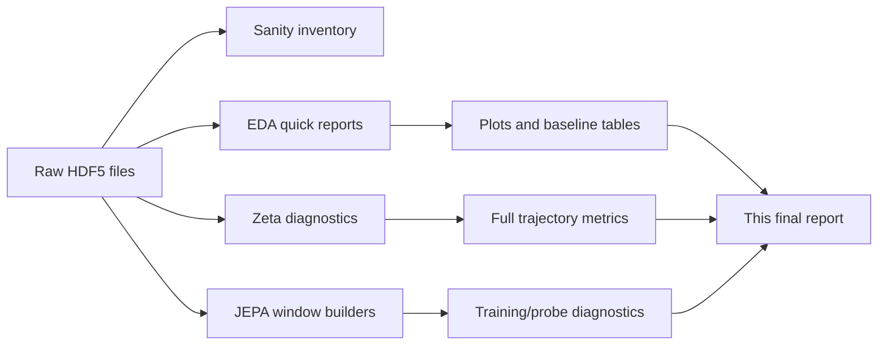

# Active Matter Data Analytics Report

This report consolidates the analytics artifacts in this workspace: exploratory notebooks, EDA scripts, generated CSV/JSON summaries, plots, sanity checks, zeta diagnostics, and JEPA smoke/training outputs. The main conclusion is that this dataset is not a generic image/video prediction problem. It is a small, highly structured physics dataset where `alpha` is strongly visible in coarse/global statistics, while `zeta` is tied to spatial organization in the tensor field, especially correlation length and local gradients.

## 1. Scope And Provenance

The report uses these artifact groups:

| Artifact group | Main files | Scope |
|---|---|---|
| Full dataset sanity check | `sanity_check_outputs/sanity_summary.json`, `sanity_check_outputs/trajectory_inventory.csv` | Full local data root |
| Full zeta diagnostics | `outputs/active_matter_zeta_diagnostics_local/*` | 225 trajectories |
| Sampled EDA/forensics | `eda/forensics_outputs_quick_balanced/*`, `eda/forensics_outputs_quick/*` | Sampled quick runs |
| Baseline regressions | `eda/forensics_outputs_*/*baseline*` | Small grouped-CV feature baselines |
| Modeling diagnostics | `glospa/am_jepa_vit_local/*`, `files/outputs/*` | JEPA smoke/local runs |
| Notebooks | `active_matter_zeta_diagnostics_local.ipynb`, `active_matter_jepa_global_vs_spatial.ipynb`, `eda/data_exploration.ipynb`, `eda/visualization_active_matter.ipynb` | Interactive inspection and plotting |

Important reconciliation: early EDA outputs under `eda/forensics_outputs*` are quick sampled runs. The most reliable dataset inventory is the full sanity check and zeta diagnostics, which see 82 files and 225 trajectories. The sampled EDA plots are still useful, but they should not be treated as complete dataset counts.



## Figure Gallery

The generated figures are embedded below so the report can be read visually from the Markdown preview. The same figures are also referenced again in the sections where they are discussed.

### Dataset And Channels

| Label distributions | Alpha-zeta heatmap |
|---|---|
|  |  |

| Channel histograms | Channel correlations |
|---|---|
|  |  |

### Temporal, Spatial, And Spectral Diagnostics

| Temporal dynamics | Adjacent-frame score |
|---|---|
|  |  |

| Temporal delta energy | Radial power spectra |
|---|---|
|  |  |

| Spectral low-high ratio | Spatial correlation length |
|---|---|
|  |  |

### Zeta Diagnostics

| Zeta vs correlation length | Zeta vs E gradient | Zeta vs nematic proxy |
|---|---|---|
|  |  |  |

| Low-zeta fields | High-zeta fields |
|---|---|
|  |  |

| Low-zeta director overlay | High-zeta director overlay |
|---|---|
|  |  |

### Feature And Baseline Outputs

| Feature PCA | Baseline regression results |
|---|---|
|  |  |

| Example frames | Concentration animation |
|---|---|
|  |  |

## 2. Dataset Inventory

The full local dataset contains:

| Item | Result |
|---|---:|
| HDF5 files | 82 |
| Trajectories | 225 |
| Train files / trajectories | 45 files / 175 trajectories |
| Valid files / trajectories | 16 files / 24 trajectories |
| Test files / trajectories | 21 files / 26 trajectories |
| Unique `alpha` values | 5: `-5, -4, -3, -2, -1` |
| Unique `zeta` values | 9: `1, 3, 5, 7, 9, 11, 13, 15, 17` |
| Alpha-zeta combinations | 45 |
| Per-trajectory shape | `T=81`, `H=256`, `W=256`, `C=11` |
| Boundary condition | Periodic in x and y |

The trajectory counts are balanced by parameter:

| Parameter view | Count pattern |
|---|---|
| Per `alpha` | 45 trajectories per alpha value |
| Per `zeta` | 25 trajectories per zeta value |
| Per alpha-zeta pair | 5 trajectories per pair |

The local files are raw trajectory shards, not the processed 16-frame, 224-crop clips referenced in the course-style brief. Windowed datasets are generated later by the training/data-loader code.


## 3. File Layout And Channels

Each HDF5 file exposes these groups:

| Group | Field | Shape contribution | Channel count |
|---|---|---:|---:|
| `t0_fields` | `concentration` | scalar field | 1 |
| `t1_fields` | `velocity` | vector field | 2 |
| `t2_fields` | `D` | 2x2 tensor | 4 |
| `t2_fields` | `E` | 2x2 tensor | 4 |

The resulting 11 channels are:

```text
concentration
velocity_x, velocity_y
D_00, D_01, D_10, D_11
E_00, E_01, E_10, E_11
```

The tensor fields are not 11 independent degrees of freedom. Diagnostics found:

| Check | Result |
|---|---|
| `D_01 == D_10` | Exact in sampled tensor checks |
| `E_01 == E_10` | Exact in sampled tensor checks |
| `E_00 + E_11 == 0` | Exact in sampled tensor checks |
| `D` trace | Mean absolute trace around 1.0, so `D` is not traceless |
| `E` trace | 0 in sampled checks |

This reduces the effective independent channel count from 11 to roughly 8:

```text
1 concentration + 2 velocity + 3 D components + 2 E components = 8
```

This is a key modeling point. A naive model can waste capacity on perfectly redundant tensor channels or exploit those redundancies as shortcuts.


## 4. Data Integrity And Leakage Checks

The full sanity check found no hard duplicate problem:

| Check | Result |
|---|---:|
| Exact duplicate file groups | 0 |
| Exact duplicate trajectory rows | 0 |
| Near-duplicate trajectory pairs | 0 |
| Cross-split near-duplicate pairs | 0 |
| Near-duplicate threshold | `1e-6` |

There are 32 duplicate filename groups because the same parameterized filename pattern appears across splits, for example the same `alpha`/`zeta` file name in train and valid/test. The sanity check did not find duplicate content.

Finite-value checks over representative full-dataset diagnostics showed:

| Field | Finite fraction | NaNs | Infs | Average mean | Average std |
|---|---:|---:|---:|---:|---:|
| concentration | 1.0 | 0 | 0 | 1.0000 | 0.00354 |
| velocity | 1.0 | 0 | 0 | ~0 | 0.76684 |
| D | 1.0 | 0 | 0 | 0.23987 | 0.37259 |
| E | 1.0 | 0 | 0 | ~0 | 0.35027 |

Normalization recommendation: use per-channel z-score normalization. Avoid per-sample normalization as the default because it can remove physically meaningful amplitude differences, especially those linked to `alpha`.

## 5. Temporal Dynamics

The sampled quick-balanced EDA found strong temporal redundancy:

| Metric | Mean | Min | Max |
|---|---:|---:|---:|
| Adjacent-frame easy score | 0.921 | 0.751 | 0.995 |
| Decorrelation lag | 6.48 frames | 2.64 | 10.67 |
| Temporal delta energy | 0.0141 | 0.00019 | 0.0621 |

Interpretation:

- Adjacent-frame prediction is too easy for representation learning.
- The system evolves slowly, so one-step reconstruction can learn interpolation shortcuts.
- Better SSL targets should use frame stride, masked temporal modeling, or future prediction beyond immediate neighbors.

Practical training implication:

```text
Avoid: target = t + 1
Prefer: context frames spaced by stride 2-4, target frames separated by a meaningful gap
```


## 6. Spatial And Spectral Structure

The sampled quick-balanced EDA found:

| Metric | Mean | Min | Max |
|---|---:|---:|---:|
| Low/high spectral ratio | 10.071 | 8.198 | 12.597 |
| Spectral anisotropy | 1.097 | 0.889 | 1.287 |
| Spatial correlation length | 27.37 px | 16.91 px | 38.73 px |

Interpretation:

- The fields are smooth and low-frequency dominated.
- Meaningful structures are spatially coherent, not pixel-local.
- Very small patches are likely to miss physics-relevant organization.
- Strong blur is not a safe augmentation because spectra and gradients are part of the signal.


## 7. Zeta Diagnostics On The Full Dataset

The dedicated zeta notebook processed all 225 trajectories and measured three orientation/spatial proxies:

- `nematic_proxy_mean`: mean Frobenius norm of the `E` tensor.
- `corr_length_mean`: spatial correlation-length proxy from the orientation field.
- `e_gradient_mean`: mean gradient magnitude proxy for local variation in `E`.

The strongest `zeta` signal was spatial correlation length:

| Metric vs `zeta` | Pearson r | Spearman r | Direction |
|---|---:|---:|---|
| `corr_length_mean` | -0.673 | -0.727 | Higher zeta -> shorter correlation length |
| `e_gradient_mean` | 0.573 | 0.558 | Higher zeta -> sharper/more locally varying E field |
| `nematic_proxy_mean` | 0.181 | 0.248 | Weak positive relation |

Mean metric values by `zeta`:

| zeta | Nematic proxy mean | Corr length mean | E-gradient mean |
|---:|---:|---:|---:|
| 1 | 0.5147 | 17.75 | 0.01994 |
| 3 | 0.6535 | 14.74 | 0.03420 |
| 5 | 0.6914 | 13.24 | 0.04335 |
| 7 | 0.7128 | 12.26 | 0.05098 |
| 9 | 0.7241 | 11.65 | 0.05752 |
| 11 | 0.7318 | 10.86 | 0.06400 |
| 13 | 0.7390 | 10.27 | 0.06988 |
| 15 | 0.7471 | 9.97 | 0.07654 |
| 17 | 0.7528 | 9.80 | 0.08237 |

Main interpretation:

```text
zeta is a spatial-organization signal.
It is most visible in orientation-field correlation length and local gradients.
It is not just a global mean/amplitude target.
```


### Low-Zeta And High-Zeta Visuals

The saved visual comparison supports the metric results: low-zeta examples show longer-range coherent structure, while high-zeta examples show shorter-scale, more locally varied orientation organization.


## 8. Alpha Diagnostics

`alpha` is much easier to recover from global/coarse statistics. Full-dataset label correlations showed:

| Metric vs `alpha` | Pearson r | Spearman r |
|---|---:|---:|
| `velocity_mag_mean` | -0.919 | -0.936 |
| `velocity_mag_std` | -0.831 | -0.882 |
| `nematic_proxy_mean` | -0.973 | -0.961 |
| `e_gradient_mean` | -0.766 | -0.780 |
| `corr_length_mean` | 0.394 | 0.447 |

Mean velocity magnitude by `alpha`:

| alpha | Velocity magnitude mean | Velocity magnitude std |
|---:|---:|---:|
| -5 | 1.002 | 0.5738 |
| -4 | 0.8076 | 0.4727 |
| -3 | 0.6083 | 0.3667 |
| -2 | 0.4142 | 0.2601 |
| -1 | 0.2482 | 0.1524 |

Main interpretation:

```text
alpha is largely encoded in coarse amplitude/energy statistics.
zeta is encoded more in spatial organization and local tensor structure.
```

## 9. Feature PCA And Regime Difficulty

The feature PCA plot summarizes handcrafted trajectory-level features from the quick-balanced EDA. It is useful for seeing whether parameter regions form clusters, but it comes from a sampled run and should be treated as exploratory.


Regime difficulty from adjacent-frame easy score in the quick-balanced run:

| Difficulty | alpha | zeta | Score |
|---|---:|---:|---:|
| Easiest | -1 | 1 | 0.992 |
| Easiest | -2 | 1 | 0.966 |
| Easiest | -1 | 11 | 0.961 |
| Easiest | -2 | 11 | 0.942 |
| Hardest | -4 | 11 | 0.756 |
| Hardest | -4 | 1 | 0.862 |
| Hardest | -3 | 1 | 0.923 |

This means global aggregate metrics can hide large regime-level variation. Evaluation should always report per-regime or per-parameter slices, not only a single average.

## 10. Baseline Regression Results

Three baseline sets exist. They differ in sample scope, so the right reading is consistency of trends, not a single final score.

### 10.1 Standalone Quick Baseline

This baseline used 12 samples from 10 unique files:

| Target | Best model | Best R2 | Interpretation |
|---|---|---:|---|
| alpha | linear | 0.431 | Alpha is partially recoverable from simple features |
| zeta | random forest | -2.245 | Zeta is not recovered in this small quick setup |

### 10.2 Quick EDA Baseline

This run used 15 sampled records:

| Target | Best model | Best R2 |
|---|---|---:|
| alpha | linear | 0.518 |
| zeta | random forest | -0.378 |

### 10.3 Quick-Balanced EDA Baseline

This run used 19 sampled records:

| Target | Model | RMSE | MAE | R2 |
|---|---|---:|---:|---:|
| alpha | ridge | 0.277 | 0.214 | 0.837 |
| alpha | linear | 0.303 | 0.225 | 0.796 |
| alpha | random forest | 0.379 | 0.333 | 0.684 |
| zeta | random forest | 1.245 | 0.958 | 0.548 |
| zeta | ridge | 1.597 | 1.389 | 0.487 |
| zeta | linear | 1.641 | 1.439 | 0.480 |

Interpretation:

- Alpha recoverability from simple features is stable across baseline variants.
- Zeta recoverability is unstable: it fails in two quick baselines and becomes positive in the quick-balanced subset.
- The positive quick-balanced zeta result should be treated cautiously because it uses a small sampled subset. It does support that handcrafted spatial/summary features contain some zeta signal, but it is not enough to prove a robust model.
- A full grouped baseline over all 225 trajectories is the next clean benchmark.


## 11. Visualization Artifacts

The repository includes direct frame visualizations and an animation:


The notebooks `eda/data_exploration.ipynb` and `eda/visualization_active_matter.ipynb` inspect HDF5 keys, field groups, boundary conditions, sample shapes, and representative frame slices. The visualization notebook confirms the available field groups:

```text
t0_fields: concentration
t1_fields: velocity
t2_fields: D, E
```

## 12. JEPA And Representation-Learning Results

The modeling artifacts are mostly smoke/local diagnostics, not finished benchmark results.

### 12.1 Window Construction

The final global-vs-spatial output tables contain:

| Output | Rows | Split counts |
|---|---:|---|
| `trajectory_split.csv` | 225 trajectories | train 175, valid 24, test 26 |
| `window_index.csv` | 4050 windows | train 3150, valid 432, test 468 |

The ViT spatial run at `glospa/am_jepa_vit_local` uses:

```text
context indices: 0,4,8,12
target indices: 16,20,24,28
frame_stride: 4
window_start_stride: 8
```

That produced 1575 windows:

| Split | Windows |
|---|---:|
| train | 1225 |
| valid | 168 |
| test | 182 |

### 12.2 Global-vs-Spatial Finding

The W&B log from the global-vs-spatial notebook contains repeated global latent collapse warnings:

```text
WARNING Global: min latent variance 2.243e-12 < 1.0e-04
WARNING Global: min latent variance 0.000e+00 < 1.0e-04
```

This supports the design decision to preserve spatial latents instead of immediately pooling to a global vector. The dataset analysis also points in that direction because the strongest zeta signal is spatial correlation length.

### 12.3 ViT Spatial Local Run

The `glospa/am_jepa_vit_local` run used `configs/vit_spatial.yaml`:

| Setting | Value |
|---|---:|
| Model type | `vit_spatial` |
| Input channels | 11 |
| Embed/latent dim | 384 |
| Context chunk length | 4 |
| Target chunk length | 4 |
| Frame stride | 4 |
| Gap | 4 |
| Epochs configured | 30 |
| Logged epochs completed locally | 1 row in `training_history.csv` |

Initialization diagnostics were healthy:

| Metric | Value |
|---|---:|
| Initial variance mean | 0.612 |
| Initial variance min | 0.260 |
| Initial effective rank | 49.86 |
| Initial alignment | -0.00088 |

The one logged epoch had:

| Metric | Value |
|---|---:|
| Global step | 307 |
| Train loss | 1229.14 |
| Valid loss | 5266.997 |
| Valid effective rank | 6.651 |
| Valid variance min | 0.521 |
| Valid variance mean | 6.820 |
| Collapse violated | False |

This is a useful health check, not a final performance result. No completed frozen-probe result file exists in this output directory.

### 12.4 CPU Smoke Runs

The `files/outputs/*` runs confirm that multiple model pipelines execute and avoid collapse, but frozen probes were skipped because smoke splits were too small or target-degenerate.

| Run | Params | Collapse violated | Probe status |
|---|---:|---|---|
| `physics_vit_jepa_local_cpu_smoke` | 257,344 | False | skipped: train/eval too small or degenerate |
| `physics_vit_jepa_local_cpu_smoke_medium` | 1,148,800 | False | skipped: train/eval too small or degenerate |
| `regular_vit_jepa_cpu_smoke` | 290,944 | False | skipped: train/eval too small or degenerate |
| `h_jepa_multiscale_cpu_smoke` | 380,112 | False | skipped: train/eval too small or degenerate |

Representative valid diagnostics:

| Run | Valid effective rank / representation diagnostic |
|---|---:|
| physics ViT smoke | valid effective rank 9.88 |
| physics ViT medium smoke | valid effective rank 14.08 |
| regular ViT smoke | valid effective rank 10.40 |
| H-JEPA multiscale smoke | valid L1/L2/L3 effective ranks about 23.33 / 28.05 / 30.89 |

The high representation-diagnostic Spearman values in smoke outputs are not reliable scientific scores because the splits are tiny. Treat them as plumbing checks.

## 13. What Was Done Across The Analytics Files

The work in this folder covers:

1. HDF5 structure discovery and file inventory.
2. Dataset split and trajectory inventory.
3. Field/key discovery for concentration, velocity, `D`, and `E`.
4. Channel statistics, histograms, and cross-channel correlations.
5. Tensor symmetry and trace checks.
6. Finite-value checks for NaN/inf safety.
7. Temporal smoothness, adjacent-frame similarity, autocorrelation, and decorrelation estimates.
8. Spatial FFT/power-spectrum diagnostics.
9. Spatial correlation-length estimates.
10. Zeta-specific orientation diagnostics across all trajectories.
11. Low-zeta versus high-zeta visual comparisons.
12. Handcrafted feature extraction.
13. PCA visualization of summary features.
14. Grouped-CV baseline regressions for alpha and zeta.
15. Duplicate, near-duplicate, and cross-split leakage checks.
16. Window-index generation for SSL/JEPA training.
17. Local JEPA smoke tests, collapse monitoring, and representation diagnostics.

## 14. Known Issues In The Artifacts

These are important if the notebooks/scripts are reused:

| Issue | File/artifact | Impact |
|---|---|---|
| Older EDA loader failed with `all input arrays must have the same shape` | `eda/eda_outputs/structure_audit.txt`, `eda/eda.py` | The older script mishandles tensor channel stacking; use `eda/analyze_active_matter.py` or the zeta notebook loader instead |
| Collapse helper smoke assertion failed | `active_matter_zeta_diagnostics_local.ipynb` | A partly collapsed random embedding was not flagged by the helper thresholds; saved zeta diagnostics are still produced before/around this section, but the helper threshold should be fixed before relying on it |
| Early sampled reports show partial dataset counts | `eda/forensics_outputs*` | Do not cite these as full dataset counts |
| Frozen probes skipped in smoke outputs | `files/outputs/*/frozen_probe_results.csv` | No actual alpha/zeta probe performance conclusion should be drawn from smoke runs |

## 15. Final Interpretation

The dataset has four dominant properties:

| Property | Evidence | Modeling consequence |
|---|---|---|
| Small but structured | 225 trajectories, 45 parameter combinations | Use strict grouped splits and report regime slices |
| Slow temporal dynamics | Adjacent-frame score around 0.92 in sampled EDA | Avoid one-step prediction objectives |
| Smooth spatial fields | Low/high spectral ratio around 10, correlation length tens of pixels | Use sufficiently large patches/receptive fields |
| Physically constrained channels | Tensor symmetries and exact redundancies | Use channel grouping or symmetry-reduced inputs |

The most important scientific result is:

```text
alpha is easy and mostly global.
zeta is harder and mostly spatial.
```

For representation learning, the best-supported direction is a spatial latent SSL objective with:

- per-channel z-score normalization,
- grouped or symmetry-reduced channel input,
- frame stride or future gap to avoid adjacent-frame shortcuts,
- masked spatiotemporal prediction or JEPA-style latent prediction,
- spatial feature maps retained through the predictor,
- frozen probes evaluated with file/trajectory grouping,
- per-regime reporting for both `alpha` and `zeta`.

## 16. Recommended Next Steps

1. Run a full grouped baseline over all 225 trajectories using the zeta diagnostics and handcrafted features.
2. Fix the collapse-warning helper threshold so partly collapsed embeddings are correctly flagged.
3. Standardize one canonical loader and retire the older `eda.py` path that fails on tensor stacking.
4. Train the spatial ViT-JEPA to completion and save frozen probe outputs for alpha and zeta.
5. Compare global pooled, spatial, and symmetry-reduced/grouped-input variants under identical splits.
6. Report final performance with per-alpha, per-zeta, and per-alpha-zeta slices.

## 17. Source Artifact Index

Primary outputs:

- `sanity_check_outputs/sanity_summary.json`
- `sanity_check_outputs/trajectory_inventory.csv`
- `outputs/active_matter_zeta_diagnostics_local/analysis_summary.json`
- `outputs/active_matter_zeta_diagnostics_local/interpretation_summary.json`
- `outputs/active_matter_zeta_diagnostics_local/tables/trajectory_summary.csv`
- `eda/forensics_outputs_quick_balanced/active_matter_dataset_report.md`
- `eda/forensics_outputs_quick_balanced/tables/*.csv`
- `eda/forensics_outputs_baseline_quick/baselines/*.csv`
- `glospa/am_jepa_vit_local/training_history.csv`
- `files/outputs/*/final_summary.json`

Primary notebooks/scripts:

- `active_matter_zeta_diagnostics_local.ipynb`
- `active_matter_jepa_global_vs_spatial.ipynb`
- `eda/analyze_active_matter.py`
- `eda/feature_baselines.py`
- `eda/data_exploration.ipynb`
- `eda/visualization_active_matter.ipynb`
- `train.py`
- `files/train.py`
- `files/model.py`
